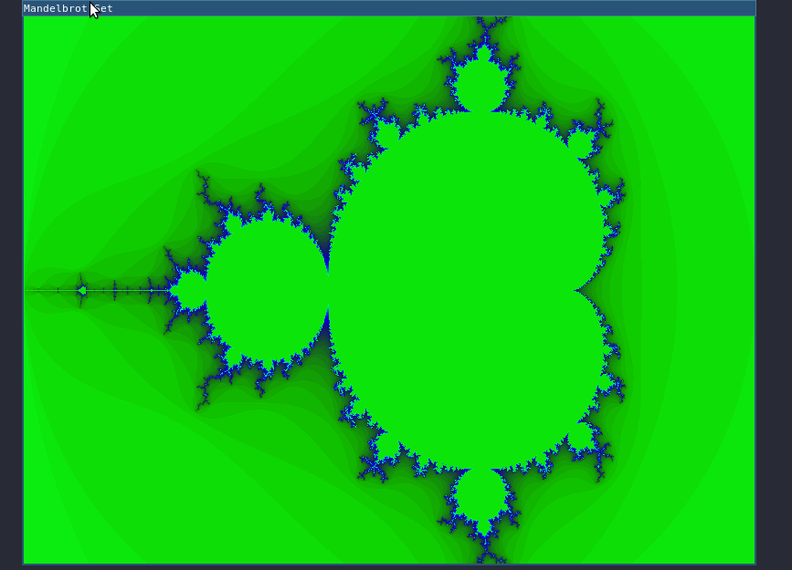

# CPPND: Capstone Mandelbrot Set Explorer

This is a the repository for the fifth and last project of the [Udacity C++ Nanodegree Program](https://www.udacity.com/course/c-plus-plus-nanodegree--nd213).

The code base can be divided architecturally and functionally into two distinct class-based components:

- Renderer component is responsible for rendering and control the explorer of the Mandelbrot set using the popular [SDL library](https://www.libsdl.org/)
- Fractal component constructs and maintains the fractal calculations and information of the explorer such as zoom, number of iterations and position of the explorer.

Once the explorer starts the user can explore the mandelbrot fractal for instructions check the [controls section ](#Controls), an example is shown below

## Dependencies for Running Locally

* cmake >= 3.7
  * All OSes: [click here for installation instructions](https://cmake.org/install/)
* make >= 4.1 (Linux, Mac), 3.81 (Windows)
  * Linux: make is installed by default on most Linux distros
  * Mac: [install Xcode command line tools to get make](https://developer.apple.com/xcode/features/)
  * Windows: [Click here for installation instructions](http://gnuwin32.sourceforge.net/packages/make.htm)
* SDL2 >= 2.0
  * All installation instructions can be found [here](https://wiki.libsdl.org/Installation)
  * Note that for Linux, an `apt` or `apt-get` installation is preferred to building from source.
* gcc/g++ >= 5.4
  * Linux: gcc / g++ is installed by default on most Linux distros
  * Mac: same deal as make - [install Xcode command line tools](https://developer.apple.com/xcode/features/)
  * Windows: recommend using [MinGW](http://www.mingw.org/)

## Basic Build Instructions

1. Clone this repo.
2. Make a build directory in the top level directory: `mkdir build && cd build`
3. Compile: `cmake .. && make`
4. Run it: `./Mandelbrot`.

## Controls
- Use **arrow eys** to explore the mandelbrot set
- Use **z/x keys** to increment/decrement number of iterations
- Use **c/v keys** to zoom in/zoom out
- Use **esc key** to close

# Rubric Items Matched

### 1 Object Oriented Programming - The project uses Object Oriented Programming techniques.

> The project code is organized into classes with class attributes to hold the data, and class methods to perform tasks.

To meet this requirement, a `Fractal` class was created to hold information about the fractal. Another class `Rendered` is created to manage the window renderer and control fucntions.

###  2 Object Oriented Programming - Classes use appropriate access specifiers for class members.

> All class data members are explicitly specified as public, protected, or private.

Within `metagame.h`, the private variable `platformUsed` (line 19) is used to store the user's detected system. No other class can mutate this variable.

### 3 Object Oriented Programming - Class constructors utilize member initialization lists.

> All class members that are set to argument values are initialized through member initialization lists.

Inside `Fractal` and `Renderer` class both constructors use initialization lists to initialize the height and width of the Fractal and Window respectively.

### 4 More ActionsThe project makes use of references in function declarations.
> At least two variables are defined as references, or two functions use pass-by-reference in the project code.

In `Renderer`  class the method `loop` and `controller`use a reference to an object of the `fractal` class in order to modify its state.

### 5 The project uses destructors appropriately.

> At least one class that uses unmanaged dynamically allocated memory, along with any class that otherwise needs to modify state upon the  termination of an object, uses a destructor.

`Fractal` class uses a raw pointer to as an array to store the calculations of the Mandelbrot set, the destructor of this class frees the memory allocated by this pointer, `Renderer` class use a destructor to delete properly the window and render objects of the SDL library.

### The project uses multithreading.

> The project uses multiple threads in the execution.

The `Fractal` class use multhithreading to speed up the calculations of the mandelbrot fractal.

# References 

- [Mandelbrot Set](https://en.wikipedia.org/wiki/)
- [Plotting algorithms for the Mandelbrot Set](https://en.wikipedia.org/wiki/Plotting_algorithms_for_the_Mandelbrot_set)
- [SDL2 and CMake](https://trenki2.github.io/blog/2017/06/02/using-sdl2-with-cmake)
- [SDL2 Docs](https://wiki.libsdl.org)
